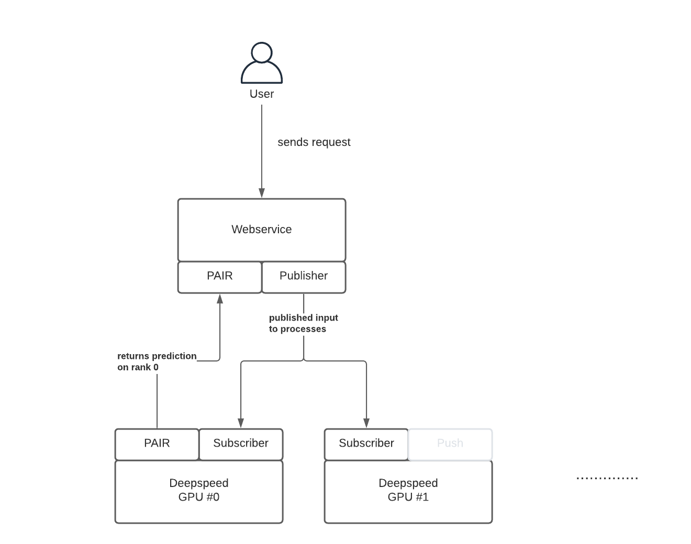

# Working I/O Example with Webserver for Deepspeed Inference

Currently it is only possible to run `deepspeed` inference with the `launcher` this makes creating I/O applications pretty difficult. This is a PoC for how to implement I/O using [0MQ](https://learning-0mq-with-pyzmq.readthedocs.io/en/latest/pyzmq/pyzmq.html) with Pub/Sub & PAIR pattern + a web service running Starlette. 

The inference code is located in [inference.py](inference.py) and the webservice code in [server.py](server.py).

The communication looks like that:





## Getting Started

To run the example make sure you have everything installed and then you can run 

```bash
python3 server.py
```

Request: 
```bash
curl --request POST \
  --url http://localhost:8500/ \
  --header 'Content-Type: application/json' \
  --data '{
	"inputs": "Hugging Face can do",
	"paramters": {
		"min_length": 75,
		"max_length": 250
	}
}'
```